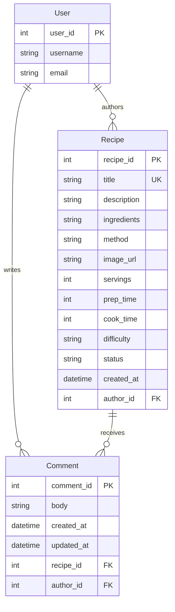

# reci.py - Recipe Website for Coders

[Live website](https://reci-py-93c536d719a2.herokuapp.com/)

reci.py is a Django recipe website where visitors can discover public recipes and registered users can submit recipes, comment, and receive updates about the review process.


## Contents

1. [Design & Planning](#design--planning)
2. [Features](#features)
3. [Technologies Used](#technologies-used)
4. [Libraries Used](#libraries-used)
5. [Testing](#testing)
6. [Bugs](#bugs)
7. [Deployment](#deployment)
8. [AI](#ai)
9. [Credits](#credits)

## Design & Planning

### User Stories

* As a visitor, I can browse approved recipes so that I can discover something to cook.
* As a visitor, I can search, filter, sort, and paginate recipes so that I can find a suitable recipe quickly.
* As a visitor, I can open a recipe to see its ingredients, method, image, timings, author, and date.
* As a registered user, I can submit a recipe so that I can share it with others.
* As a recipe author, I can receive notifications when my recipe is submitted, approved, rejected, or commented on.
* As a registered user, I can comment on recipes and manage my own comments.
* As a staff reviewer, I can approve or reject pending recipes and comments.

### Wireframes


### Agile Methodology

Development was organised around small user stories and acceptance criteria. Features were tested as they were implemented, with priority given to recipe discovery, authenticated submission, moderation, comments, and notifications.

> 

### Typography

* **DM Sans** is used for interface text.
* **Fraunces** is used for headings.
* **JetBrains Mono** is available for code-style details.

>

### Colour Scheme

* **Warm Cream (`#FFF8F0`)**: Page background and light surfaces.
* **Ink (`#2B2118`)**: Main text, headings, and footer content.
* **Tomato (`#B54128`)**: Buttons, links, and interactive accents.
* **Butter (`#F2C14E`)**: Highlights and visual emphasis.
* **Basil (`#3A7022`)**: Tags and positive recipe states.
* **Crust (`#F3EED0`)**: Soft panels, borders, and secondary surfaces.
* **Muted (`#6B5B4E`)**: Secondary text.

> 

### Branding

**Logo**


**Tagline**  
*Simple Recipes • Healthy Meals • For Coders*

Reci.py is a recipe-sharing platform built specifically for developers and coders. It combines clean, simple recipes with healthy meal ideas in an interface that feels right at home for the tech community.

### Database Diagram



Recipe statuses are `pending`, `approved`, `published`, and `rejected`. New submissions begin as `pending` and are reviewed by staff.

> **Screenshot placeholder:** Add a database diagram screenshot if a visual diagram is preferred.

## Features

### Navigation

The responsive navigation provides links to Home, Register, Login, Profile, Submit recipe, Notifications, and the staff Admin area when appropriate. The mobile menu collapses using Bootstrap.

> **Screenshot:** 

### Footer

The footer contains the team attribution and social media links, including the project GitHub repository.

> **Screenshot:** 

### Home Page

The homepage displays approved and published recipes in responsive cards. Visitors can search by title or description, filter by difficulty, sort by date, title, or preparation time, and use pagination.

> **Screenshot:** 

### Recipe Detail Page

Each public recipe shows its image, description, servings, preparation and cooking times, ingredients, numbered method, author, date, and approved comments.

> **Screenshot:** 

### Submit Recipe

Authenticated users can submit recipe details, an optional uploaded image, or an image URL. Required fields, positive numeric values, and unique recipe titles are validated. New recipes are stored as `pending`.

> **Screenshot:** 

### Profile

Authenticated users can view their profile and update their email address.

> **Screenshot:** 

### Notifications

Authenticated users receive notifications for recipe submission, approval, rejection, and comments. The navigation displays an unread badge, and notifications can be marked as read from the inbox.

> **Screenshot:** 

### Comments

Authenticated users can comment on public recipes. Comment authors can edit or delete their own comments, and ownership checks protect these actions.

> **Screenshot:** 

### CRUD

* **Create**: Registered users create recipes and comments.

* **Read**: Visitors read public recipes and approved comments.

* **Update**: Users update their profile email and their own recipe's.
* **Delete**: Users delete their own comments.


* **Moderate**: Staff approve or reject pending recipes and comments.


### Authentication & Authorisation

Django Allauth provides registration and login. Login protection is applied to user-only pages, staff-only review pages require staff status, and comment edit/delete actions require ownership.


## Technologies Used

* Python
* Django 6.1.1
* HTML5, CSS3, and JavaScript
* PostgreSQL in deployment
* Heroku
* Git and GitHub

## Libraries Used

* Django Allauth for authentication.
* Bootstrap 5 for responsive layout, cards, forms, navigation, and pagination.
* Font Awesome for interface icons.
* Django Crispy Forms and Crispy Bootstrap 5 for form rendering.
* django-notifications-community for the notification inbox and unread badge.
* WhiteNoise and Django staticfiles for static asset handling.

## Testing

### Manual Testing

The following tables are ready for a screenshot to be added to each test case. Replace each placeholder with the relevant image link when testing is complete.

#### User Stories

| User story | Test steps | Expected result | Screenshot |
| --- | --- | --- | --- |
| Browse public recipes | Open the homepage as a visitor. | Approved and published recipes appear; pending and rejected recipes remain hidden. | `[Screenshot placeholder: user story 1]` |
| Find a suitable recipe | Search, filter by difficulty, sort, and change page. | Results and ordering update while the selected controls remain usable. | `[Screenshot placeholder: user story 2]` |
| View recipe information | Open a recipe card. | The detail page shows the recipe image, ingredients, method, timings, author, and date. | `[Screenshot placeholder: user story 3]` |
| Submit a recipe | Log in, complete the form, and submit it. | The recipe is saved as `pending` and a confirmation message is shown. | `[Screenshot placeholder: user story 4]` |
| Receive recipe notifications | Submit, approve, or reject a recipe. | The relevant author receives an unread notification in the inbox. | `[Screenshot placeholder: user story 5]` |
| Comment on a recipe | Log in and submit a valid comment. | The comment appears and the recipe author is notified when applicable. | `[Screenshot placeholder: user story 6]` |
| Manage own comments | Edit and delete a comment created by the logged-in user. | The comment is updated or removed; another user's comment cannot be managed. | `[Screenshot placeholder: user story 7]` |
| Review submissions | Sign in as staff and approve or reject a pending recipe. | The recipe status changes and public visibility follows the decision. | `[Screenshot placeholder: user story 8]` |

#### Features

| Feature | Test steps | Expected result | Screenshot |
| --- | --- | --- | --- |
| Navigation | Use the desktop navigation and open the mobile menu. | Correct links are shown for the user's role and the menu works on small screens. | `[Screenshot placeholder: feature 1]` |
| Footer | Scroll to the bottom of a page and select a social link. | Footer content is visible and links open correctly. | `[Screenshot placeholder: feature 2]` |
| Homepage cards | Load the homepage with public recipes available. | Recipe cards display consistently with working detail links. | `[Screenshot placeholder: feature 3]` |
| Search and filtering | Search by title/description and select each difficulty. | Matching recipes remain and unrelated recipes are removed. | `[Screenshot placeholder: feature 4]` |
| Sorting and pagination | Select each sort option and move between pages. | Card order changes and pagination works without losing the current query. | `[Screenshot placeholder: feature 5]` |
| Recipe detail | Open an approved recipe. | All recipe details and approved comments are readable. | `[Screenshot placeholder: feature 6]` |
| Form validation | Submit empty fields, duplicate titles, and non-positive numbers. | Clear field-level validation messages prevent invalid submission. | `[Screenshot placeholder: feature 7]` |
| Profile and notifications | Update an email address and mark a notification as read. | The profile saves and the notification is removed from the unread list. | `[Screenshot placeholder: feature 8]` |
| Responsive layout | Test the homepage, forms, detail page, and inbox at desktop, tablet, and mobile widths. | Content stacks correctly without horizontal scrolling or distorted images. | `[Screenshot placeholder: feature 9]` |


### Performance and Responsiveness

| Feature                  | Test steps                                                                 | Expected result                                      | Screenshot                  |
|--------------------------|----------------------------------------------------------------------------|------------------------------------------------------|-----------------------------|
| Am I responsive          | Resize the browser window or use device emulation to test multiple breakpoints. | Layout adapts correctly on desktop, tablet, and mobile. |              |
| Home page                | Load the homepage on different screen sizes.                               | All content is visible and properly aligned.         |               |
| Recipe page              | Open a recipe detail page on various screen widths.                        | Recipe content, images, and comments display correctly. |             |
| Sign up page             | View the sign-up form on desktop, tablet, and mobile.                      | Form fields and buttons are responsive and usable.   |            |
| Sign in page             | View the sign-in form on multiple devices.                                 | Form layout and validation work correctly.           |            |
| Profile page             | Open the user profile on different screen sizes.                           | Profile information and actions are accessible.      |            |
| My recipe page           | View the “My Recipes” page on desktop and mobile.                          | Recipe list and management buttons respond well.     |          |
| Notification page        | Open the notifications page on various devices.                            | Notifications list displays cleanly on all screens.  |       |


### Automated Tests

Install dependencies before running Django commands:

```powershell
python -m pip install -r requirements.txt
```

Run the focused recipe tests:

```powershell
.\.venv\Scripts\python.exe manage.py test core.test_recipe_submission
```

Run the full test suite:

```powershell
.\.venv\Scripts\python.exe manage.py test
```

Run Django system checks:

```powershell
.\.venv\Scripts\python.exe manage.py check
```

The project also includes HTML and CSS validation tests in `core/test_valid.py`. These tests use the W3C validator supplied in the `fixtures` directory and require Java. Accessibility checks include image alternative text, labelled form fields, keyboard navigation, logical headings, colour contrast, and assistive-technology state for recipe detail controls.

## Bugs

No known bugs are outstanding at the time of writing. Any newly discovered issue should be recorded with reproduction steps, expected behaviour, actual behaviour, and its resolution.

> **Screenshot placeholder:** Add evidence of the final bug-testing pass if required.

## Deployment

The deployed application is hosted on Heroku:

[https://reci-py-93c536d719a2.herokuapp.com/](https://reci-py-93c536d719a2.herokuapp.com/)

The deployment uses PostgreSQL, environment-based configuration, WhiteNoise for collected static files, and a `Procfile` to start the Django application. Before deployment, install requirements, configure environment variables, run migrations, collect static files, and create a staff user for the review workflow.

## AI

AI tools were used as development support for brainstorming, documentation structure, debugging guidance, and reviewing implementation details. All generated suggestions were checked against the project code, tests, and final application behaviour.

## Credits

* Bootstrap documentation and components: [getbootstrap.com](https://getbootstrap.com/)
* Font Awesome icons: [fontawesome.com](https://fontawesome.com/)
* Django documentation: [docs.djangoproject.com](https://docs.djangoproject.com/)
* Django Allauth documentation: [docs.allauth.org](https://docs.allauth.org/)
* Project repository: [github.com/lion695/reci.py](https://github.com/lion695/reci.py)
