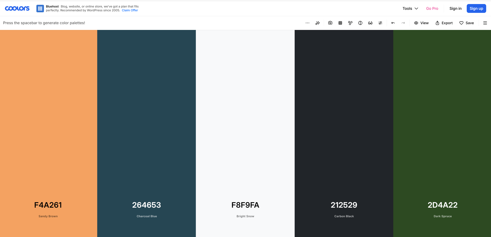
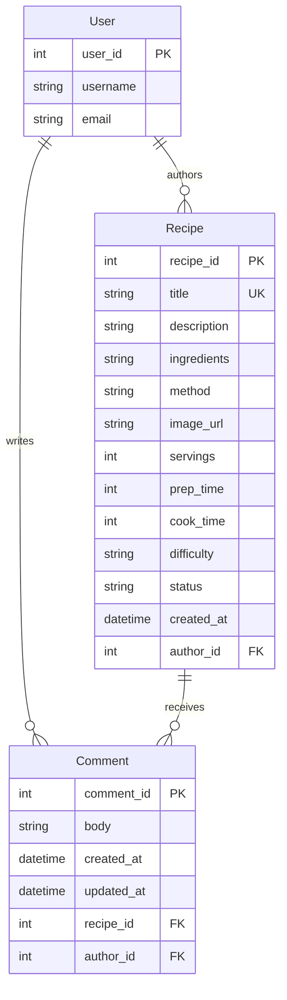

# reci.py - Recipe Website for Coders

[Live website](https://reci-py-93c536d719a2.herokuapp.com/).

## Overview

reci.py is a Django recipe website where visitors can discover public recipes and registered users can submit recipes, comment, and receive updates about the review process.

## Screenshots


## Design and Colour Palette

The visual design is built over Bootstrap with a warm editorial recipe style. **DM Sans** is used for interface text and **Playfair Display** is used for headings.

* **Charcoal Blue (`#264653`)**: Primary navigation and structural elements.
* **Sandy Brown (`#F4A261`)**: Highlights, borders, and interactive accents.
* **Bright Snow (`#F8F9FA`)**: Light interface surfaces.

* **Carbon Black (`#212529`)**: Main text colour.
* **Dark Spruce (`#2D4A22`)**: Headings and positive recipe states.



## Data Model

### Database Architecture



Recipe statuses are `pending`, `approved`, `published`, and `rejected`. New submissions begin as `pending` and are reviewed by staff.

## User Roles and Stories

### Target User Roles

* **Visitor**: Browse public recipe cards, search, filter, sort, and open a full recipe.
* **Registered User**: Submit recipes, update profile details, comment on recipes, and receive notifications.
* **Recipe Author**: Track whether submitted recipes are pending, approved, or rejected.
* **Staff Reviewer**: Review pending recipes and approve or reject them.

### User Stories

* As a visitor, I can browse approved recipes from the homepage so that I can discover something to cook.
* As a visitor, I can search, filter by difficulty, and sort recipes so that I can find a suitable recipe quickly.
* As a visitor, I can open a recipe to see its ingredients, method, image, servings, timings, author, and date.
* As a logged-in user, I can submit my own recipe so that I can share it with others.
* As a recipe author, I receive a notification when my recipe is submitted, approved, or rejected.
* As a logged-in user, I can comment on a recipe so that I can share feedback with its author.
* As a recipe author, I receive a notification when another user comments on my recipe.
* As a staff reviewer, I can review pending recipes and approve or reject them.

## Features

### Recipe Discovery

* Responsive Bootstrap recipe cards on the homepage.
* Search by recipe title or description.
* Filter by easy, medium, or hard difficulty.
* Sort by newest, oldest, title, or quickest preparation time.
* Pagination that preserves search, filter, and sort choices.
* Detail pages with recipe image, servings, prep and cook time, ingredients, numbered method, author, and date.
* Pending and rejected recipes are excluded from public discovery.

### Recipe Submission and Review

*   Logged-in users can submit a recipe through a labelled form.
*   Required recipe fields are validated.
*   Servings, prep time, and cook time must be positive.
*   Recipe titles must be unique.
*   New recipes start with `pending` status.
*   Staff can approve or reject pending recipes from the review flow.

### Accounts and Notifications

*   Django Allauth handles registration and login.
*   Users can access a profile page after logging in.
*   The navigation shows a notification bell and unread badge for authenticated users.
*   Notifications are stored in an inbox and can be marked as read.
*   Authors receive notifications for recipe submission, approval, rejection, and comments.

### Comments

*   Logged-in users can post comments on public recipes.
*   Comment authors can edit or delete their own comments.
*   Comment ownership is checked before edit and delete actions.

### Visual Design and Assets

*   Bootstrap provides the responsive grid, cards, forms, navigation, and pagination.
*   Custom CSS defines the recipe-focused palette, typography, toolbar, cards, and detail panels.
*   Font Awesome provides interface icons.
*   WhiteNoise serves collected static files in deployment.


## Testing

Testing is organised by user story and by the main interface areas so that new work can be added without turning the README into a large test script.

### User Stories

| Area | Manual test | Expected result |
| --- | --- | --- |
| Recipe submission | Log out and visit Submit recipe | The visitor is redirected to login. |
| Recipe submission | Submit a complete recipe while logged in | The recipe is saved as `pending` and a confirmation message appears. |
| Recipe validation | Leave required fields empty | The form shows field-level errors. |
| Recipe validation | Enter zero or negative servings/times | The form rejects the values. |
| Recipe review | Approve a pending recipe as staff | The recipe becomes visible in public recipe cards. |
| Recipe review | Reject a pending recipe as staff | The recipe remains hidden from public pages. |
| Recipe detail | Click an approved recipe card | The full recipe detail page opens. |
| Comments | Post a comment while logged in | The comment appears and the author receives a notification. |
| Notifications | Approve, reject, or comment on a recipe | The relevant user sees an unread notification in the inbox. |

### Features

*   Confirm that the homepage loads recipe cards when public recipes exist.
*   Search for a word in a recipe title and description.
*   Select each difficulty option and confirm that unrelated recipes disappear.
*   Select each sort option and confirm that the card order changes.
*   Move between pagination pages and confirm that search/filter values remain active.
*   Open a recipe card and confirm all recipe information is present.

### Responsive Testing

Test the homepage, submission form, detail page, comments, and notification inbox at desktop, tablet, and mobile widths.

*   Confirm the navigation collapses into the Bootstrap menu on smaller screens.
*   Confirm the toolbar fields stack without horizontal scrolling.
*   Confirm recipe cards resize from three columns to two columns and then one column.
*   Confirm recipe images do not distort or overflow their cards.
*   Confirm detail page content remains readable and the Ingredients and Method panels fit the viewport.
*   Confirm buttons, form controls, pagination, and notification links remain usable by touch.

### Automated Tests

Run the focused recipe tests with:

```powershell
.\.venv\Scripts\python.exe manage.py test core.test_recipe_submission
```

The focused tests cover:

*   Login protection for recipe submission.
*   Required fields, positive numeric values, and unique titles.
*   Pending status and submission confirmation messages.
*   Published and approved recipe detail pages.
*   Hidden pending and rejected recipes.
*   Homepage recipe links and search/difficulty filtering.

Run Django system checks with:

```powershell
.\.venv\Scripts\python.exe manage.py check
```

### HTML, CSS, and Accessibility Validation

The project includes validation tests in `core/test_valid.py` for the main pages and stylesheet. These tests use the W3C validator supplied in the `fixtures` directory.

Manual accessibility checks include:

*   Every meaningful image has useful alternative text.
*   Form fields have visible labels.
*   Navigation and recipe actions are keyboard reachable.
*   Heading levels follow a logical order.
*   Colour contrast remains readable against the custom palette.
*   The recipe detail Ingredients and Method controls expose their state to assistive technology.

### Known Test Setup Requirement

Install the project dependencies before running Django commands:

```powershell
python -m pip install -r requirements.txt
```

The notification features require `django-notifications-community`, and the HTML/CSS validation tests require Java to run the W3C validator.

## Technology Stack

*   **Core Framework**: Django 6.1.1 with Python.
*   **Authentication**: Django Allauth.
*   **Frontend UI**: Bootstrap 5 and Font Awesome.
*   **Forms**: Django Crispy Forms with Crispy Bootstrap 5.
*   **Notifications**: django-notifications-community.
*   **Database**: PostgreSQL in deployment, with environment-based configuration.
*   **Static Assets**: WhiteNoise and Django staticfiles.
*   **Deployment**: Heroku.
