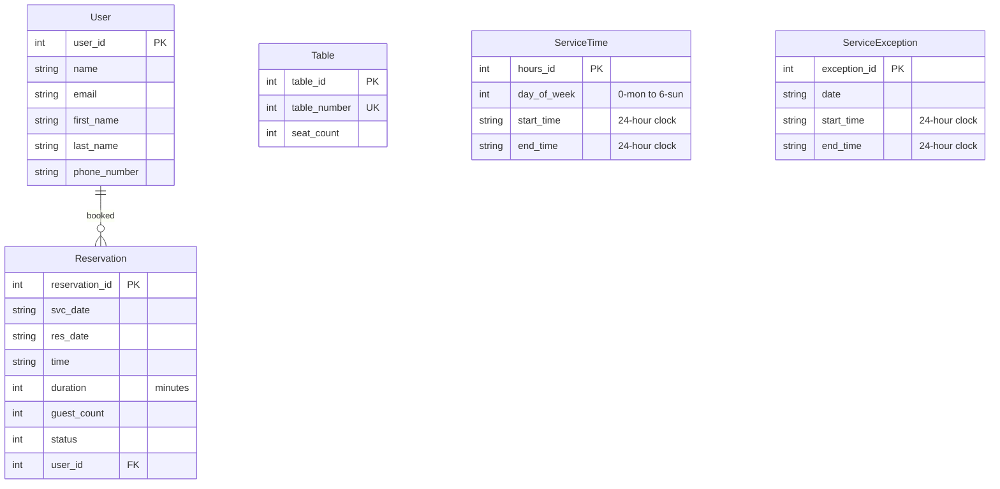

# reci.py - Recipe Website for Coders

[Live website](https://reci-py-93c536d719a2.herokuapp.com/).

## Screenshot

## Design & Color Palette

The visual design is structured using a custom theme built over Bootstrap, prioritizing high contrast and a developer-centric layout using the **PT Serif** font family. The palette is defined as follows:

*   **Charcoal Blue (`#264653`)**: Used as the primary color for structural elements like the main header navigation block.
*   **Sandy Brown (`#F4A261`)**: Applied as the bright highlight accent color for hover items and structural borders.
*   **Bright Snow (`#F8F9FA`)**: The core universal background color for standard views.
*   **Carbon Black (`#212529`)**: The high-contrast text color profile.
*   **Dark Spruce (`#2D4A22`)**: The accent color reserved for specific interactive application headings and booked reservation states.

## Data Model

### Database Architecture

## User Roles and Stories

### Target User Roles
*   **Recipe Author**: A coder looking to submit, maintain, and showcase technical culinary scripts.
*   **Site Visitor**: A user searching the application database for structural meal preparation guides.

### In-Progress User Stories
*   **Recipe Management Authorization (Must-Have)**: As a recipe author I can edit or delete my own recipes so that I can fix mistakes or remove them.
    *   *Acceptance Criteria*:
        *   Edit/Delete control actions appear exclusively on documents owned by the logged-in author.
        *   Destructive actions (Delete) trigger an explicit front-end confirmation prompt before completion.
        *   Unauthorized modification attempts via direct URL manipulation drop execution and return a secure **403 Forbidden** server page response.

## Features & Implementation Progress

*   **Unified Application Theme**: Upgraded standard Bootstrap specificity paths to cleanly execute custom palette variables without relying on performance-degrading `!important` tags.
*   **Asset Pipeline Integration**: Stabilized the layout render loops for core vector properties:
    *   `static/images/reci_py_logo.png` inside the brand navbar element.
    *   `static/favicon/favicon.ico` running via explicit cache-busted header tags (`?v=2`).

    

## Technology Stack

*   **Core Framework**: Django 6.1.1 (Python-based dynamic templating architecture).
*   **Frontend UI Utilities**: Bootstrap 5 + Font Awesome Brand Icon Assets.
*   **Styles**: Standard Scoped Custom CSS.
*   **Static Asset Management**: WhiteNoise Pipeline Utility + Heroku Direct Engine Compilation.
